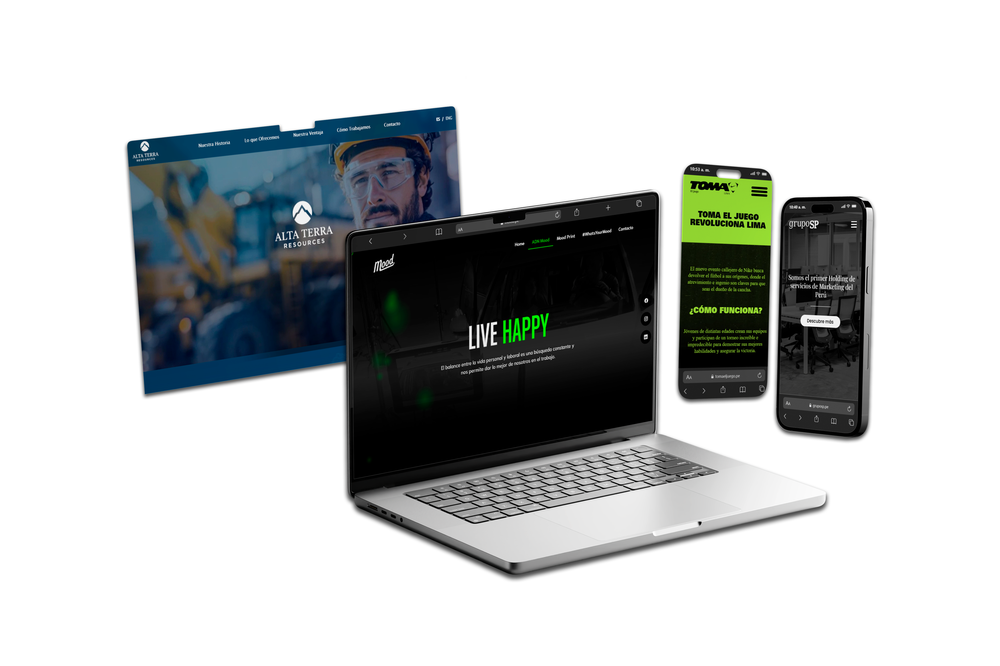
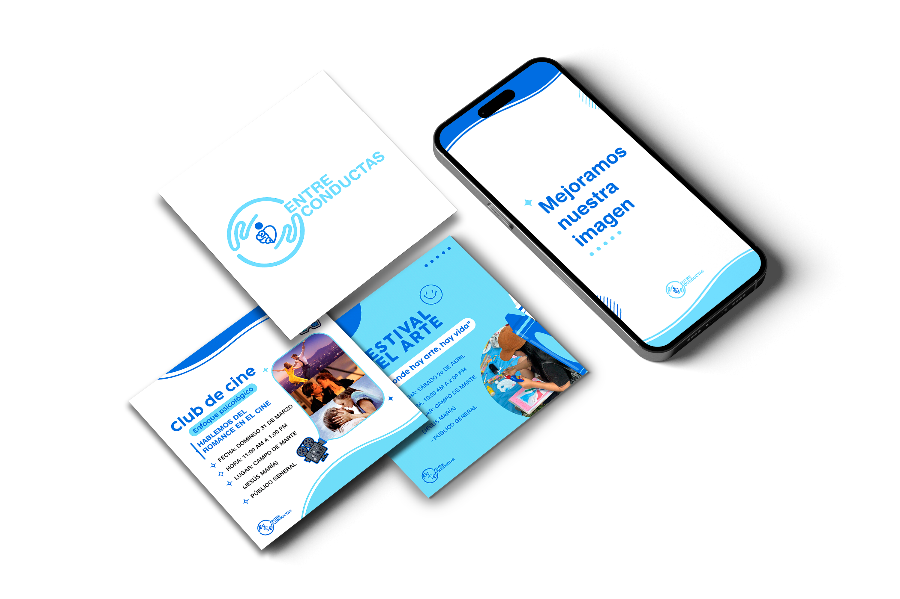

# WithMe | Agencia de Marketing Digital 🚀

¡Bienvenido al repositorio oficial de **WithMe**! Somos una agencia de marketing digital apasionada por ayudar a las marcas a crecer y conectar con su audiencia en el mundo online. Este repositorio contiene el código fuente completo de nuestro sitio web.

## ✨ Nuestros Servicios

Ofrecemos una gama de servicios diseñados para impulsar tu presencia en línea:

*   **🌐 Desarrollo Web:** Creamos sitios web modernos, funcionales y adaptados a tus necesidades. Desde landing pages hasta sitios corporativos completos.
*   **🎨 Branding:** Construimos identidades de marca sólidas y coherentes que resuenan con tu público objetivo.
*   **📱 Social Media:** Gestionamos tus redes sociales para aumentar el engagement, construir una comunidad y alcanzar tus objetivos de negocio.
*   **✍️ Creación de Contenido:** Producimos contenido de valor que atrae, informa y convierte a tu audiencia.

## 🚀 Demo en Vivo

Puedes ver nuestro sitio en acción aquí: **[With Me](https://estudiowithme.com)** 

## 📸 Vistazo Rápido

<table>
  <tr>
    <td align="center"><strong>Desarrollo Web</strong></td>
    <td align="center"><strong>Social Media</strong></td>
    <td align="center"><strong>Creación de Contenido</strong></td>
  </tr>
  <tr>
    <td></td>
    <td></td>
    <td></td>
  </tr>
</table>

## 💻 Tech Stack

Este proyecto está construido con tecnologías web estándar y robustas:

*   **Frontend:** HTML5, CSS3, JavaScript
*   **Backend:** PHP (para el procesamiento de formularios)

## 📂 Estructura del Proyecto

```
WithMe/
├── app/                # Lógica de JavaScript
├── pages/              # Páginas HTML individuales
├── recursos/           # Assets (imágenes, logos, fuentes)
├── styles/             # Hojas de estilo CSS
├── index.html          # Página de inicio
├── procesar_formulario.php # Script para el formulario de contacto
└── README.md
```

## 🏁 Cómo Empezar

Para ejecutar una copia local de este proyecto:

1.  **Clona el repositorio:**
    ```bash
    git clone https://github.com/tu-usuario/WithMe.git
    ```
2.  **Navega al directorio:**
    ```bash
    cd WithMe
    ```
3.  **Inicia un servidor local:**
    Dado que el proyecto utiliza PHP para el formulario de contacto, necesitarás un entorno de servidor como XAMPP, WAMP, MAMP o puedes usar el servidor incorporado de PHP.
    ```bash
    php -S localhost:8000
    ```
4.  Abre tu navegador y ve a `http://localhost:8000`.


---


<p align="center">Hecho por Danny Alexander</p>
<p align="center">Github: @DannyAlexander07</p>
